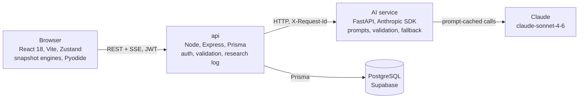

# DSA Tutor

[](https://github.com/tsegale/dsa-tutor/actions/workflows/ci.yml)

A data structures and algorithms tutor that stops the algorithm at the moments that matter and makes you predict the next step before it continues, with AI feedback on why a wrong prediction was wrong.

Built as a final-year Computer Science research project at the University of Namibia, and instrumented to measure whether it works.

**Live:** https://dsa-tutor-web.vercel.app. Use **Try the demo without an account** on the login page: it creates a temporary account for one day, with a capped AI allowance, that never counts as study data.

**API reference:** generated from the live route table at `/api/v1/docs` on the api ([production](https://api-production-5c1d5.up.railway.app/api/v1/docs)).

## What it does

- **Practice mode.** The run pauses at critical junctions (swap or leave, which half to search, left or right in a BST) and will not advance until you answer. Steps the learner already handles well become worked examples as scaffolding fades.
- **Misconception-aware feedback.** Every wrong option is labelled with the misconception it represents. A wrong first answer opens a misconception event: a short Quick Check, then a re-probe on a different junction, until it resolves or is marked persistent.
- **Research instruments.** Pre and post tests, a within-subject Classic control (each participant uses a plain visualiser on one topic), self-explanation prompts, and exports for analysis.

## Architecture



| Part | Where | Deployed on |
| --- | --- | --- |
| Web app | `apps/web` | Vercel |
| api | `apps/api` | Railway (EU West) |
| AI service | `apps/ai` | Railway (EU West) |
| Shared types | `packages/types` | - |
| Database | PostgreSQL | Supabase (eu-west-2) |

The snapshot engine is a pure function: given an input, it returns every step of the run as an immutable array. Stepping back is an index change, never a recomputation. The canvas renders React SVG; D3 is used for layout calculations only.

## Engineering highlights

- **Deterministic grading; the model only explains.** Right or wrong is decided in code from the recorded state, before any model call. Code Mode runs the student's Python in Pyodide and compares the resulting array. The model is told the verdict and asked to explain it. See [ADR 0001](docs/adr/0001-deterministic-correctness.md).
- **Validated output with bounded retries.** Every model response is checked against a Pydantic schema and content rules (no statement of the answer after a wrong one, no notation foreign to the pseudocode, a two-sentence cap). Prediction feedback makes one call with no retry (a measured 4s-budget retry recovered 0 of 5 failures); hints get one retry inside a fixed time budget.
- **Algorithm-aware fallback with provenance.** A field that fails validation is replaced by rule-based text for that algorithm, junction and scaffolding level, and the interaction log records `aiGenerated` and `aiFailureReason` for what was actually displayed. See [ADR 0002](docs/adr/0002-algorithm-aware-flagged-fallback.md).
- **Prompt caching, measured.** The static prompt prefix is cached. In 19 paired cold and warm calls, every warm call read the full cached prefix and wrote none; median time to first token fell from 1,276 ms to 1,048 ms (-18%) and total time from 7,156 ms to 6,703 ms (-6%).
- **Streamed feedback that never shows unvalidated text.** Feedback streams one sentence at a time, each validated before it is sent. A sentence already shown is final.
- **Research instrumentation.** Every interaction row carries the prompt version and model that produced it. Exports are pilot-aware and carry participant codes only. A rater-agreement pipeline computes Cohen's kappa between human raters and the rule and AI labels. The educator dashboard shows AI latency, cache hit rate and the wrong-answer fallback rate.
- **Guard rails.** Every route is validated by a zod schema and a coverage test fails CI if one is missing ([ADR 0006](docs/adr/0006-centralised-request-validation.md)). XP is derived on the server from logged interactions, never sent by the client. Request ids are propagated from the api to the AI service and logged as JSON on both sides.

Design decisions are recorded in [docs/adr](docs/adr).

## Tests

| Suite | Tests |
| --- | --- |
| Web (Vitest) | 1,122 |
| api (Vitest, Supertest) | 261 |
| AI service (pytest) | 225 |

CI runs typecheck, all three suites and the production build on every push.

## Running locally

Requirements: Node 18+ (CI uses 20), pnpm 10, Docker, and an Anthropic API key for AI feedback.

With Docker Compose (web, api, AI service, Postgres):

```bash
cp apps/api/.env.example apps/api/.env
cp apps/ai/.env.example apps/ai/.env        # set ANTHROPIC_API_KEY
JWT_SECRET=dev-secret ANTHROPIC_API_KEY=sk-... docker compose up --build
```

Or run the services directly:

```bash
pnpm install
docker compose up -d postgres
pnpm --filter api exec prisma migrate dev   # creates the schema and seeds topics
pnpm dev                                    # web on :5173, api on :3001

cd apps/ai
python -m venv .venv && .venv/Scripts/pip install -r requirements.txt   # bin/ on macOS and Linux
.venv/Scripts/uvicorn main:app --port 8000
```

The app works without the AI service: grading is local, and feedback falls back to the rule-based text.

Checks:

```bash
pnpm typecheck && pnpm test && pnpm build
cd apps/ai && .venv/Scripts/python -m pytest
```

## More

- [DEPLOYMENT.md](DEPLOYMENT.md): production services, regions and environment variables.
- [STUDY_PROTOCOL.md](STUDY_PROTOCOL.md): the study design, conditions, completion rule and consent.
